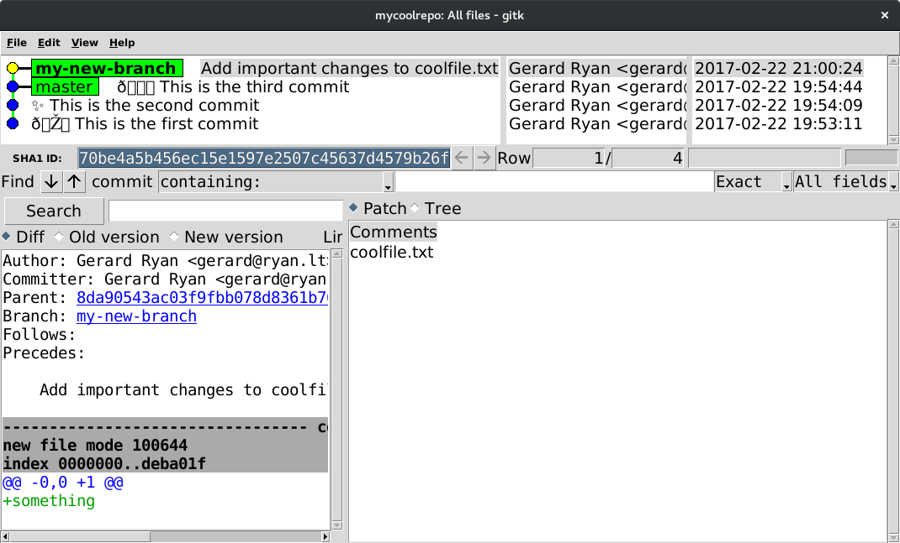
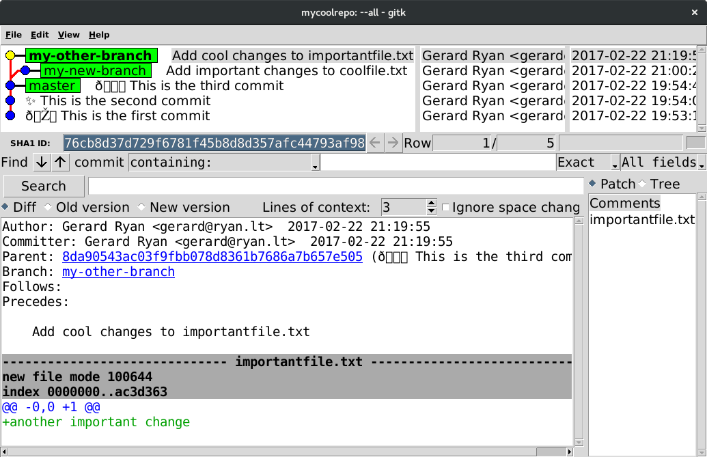

# Branches and branching

## What are branches?

Git is a Source Control Management (SCM) tool that helps manage the
 different states that some source content (often software source
 code) over time. Each commit is a different state, and we usually
 visualize these as a graph over time:


In the above image, we can see that:

* newer commits are visualized on top of the older ones
* On the very top (newest) commit, there's a blue box that says
  "master".
* We say master is the branch that is currently *"checked out"*.
* `master` is the default branch that is created when you create or
  clone a repository.

There are different Git visualization tools available for different
 computer operating systems. Usually there's one called `gitk` that
 comes installed with Git. Try executing `gitk` on the command line to
 see the current branch (or `gitk --all` to visualize all branches and
 commits).

## Create a new local repository

For the purposes of this lab, we're going to create a new local repository:

Open a shell (a Git Shell on Windows, or a regular Terminal on macOS/Linux), and create a new directory by running:

```bash
$ mkdir topic05
```

Navigate into the `topic05` directory:

```bash
$ cd topic05
```

Now initialise a Git repository from this empty directory:

```bash
$ git init
Initialized empty Git repository in C:/Users/username/topic05/.git/
```

Add a `README.md` file to the repo and commit it:

```bash
echo "Hello" >> README.md
git add README.md
git commit -m "Adding a README"
```

## Working with branches

Using the Git command line tool, you can get a list of all of your
 branches:

``` bash
$ git branch
* master
```

You can create a new branch at the same point (commit) as the current
 branch:

``` bash
$ git branch my-new-branch
```

Looking at the list of branches though, we can see that we're still on
 the master branch (the asterisk highlights the current branch):

``` bash
$ git branch
* master
  my-new-branch
```

After creating a branch, we then need to *checkout* that branch to
 switch to it:

``` bash
$ git checkout my-new-branch
Switched to branch 'my-new-branch'
```

Listing the branches again, we can see that we're now on the new
 branch. Some other commands such as `git status` will give
 information about the current branch.

On the new branch, make a new change, and commit it.

``` bash
$ echo "something" >> coolfile.txt
$ git add coolfile.txt
$ git commit -m "Add important changes to coolfile.txt"
[my-new-branch 70be4a5] Add important changes to coolfile.txt
 1 file changed, 1 insertion(+)
 create mode 100644 coolfile.txt
```

In `gitk` now, we can see that the new branch now represents a
 different state than the master branch:



You can create a branch starting from any place, not just the
 currently checked-out branch, by specifing that other location to the
 `git branch` command that we used earlier. For example, we could
 create a new branch from master as follows:

``` bash
$ git branch my-other-branch master
```

Let's instead use the following to create and checkout the new branch
 in one go:

``` bash
$ git checkout -b my-other-branch master
Switched to a new branch 'my-other-branch'
```

Again, create a new change on this branch (to a different file this
 time), and commit it:

``` bash
$ echo "another important change" >> importantfile.txt
$ git add importantfile.txt
$ git commit -m "Add cool changes to importantfile.txt"
[my-other-branch 76cb8d3] Add cool changes to importantfile.txt
 1 file changed, 1 insertion(+)
 create mode 100644 importantfile.txt
```

Visualizing now with `gitk --all`, we should see our master branch,
 and the two new branches coming out of it in different directions:



You can delete a branch like this (just an example, no need to run this):

``` bash
$ git branch -d some-other-branch
error: The branch 'some-other-branch' is not fully merged.
If you are sure you want to delete it, run 'git branch -D some-other-branch'.
```

Since in this case, there are changes on `some-other-branch` that don't
 exist anywhere else, we got an error message telling us that if we
 really want to delete it, we need to use `-D` instead of `-d`.

## What are branches *really* though?

A branch is simply a reference to a commit. Remember the first picture
 in this section? We saw a visualization of a graph of commits, with a
 blue box containing the name of the branch (master).

In each repository, there's a hidden directory named `.git`, this is
 the guts of the repository. In there, there is a file at
 `.git/refs/heads/master` which contains nothing but the sha1 hash of
 the commit that the branch is pointing at.

## What is HEAD?

`HEAD` is a special pointer that points to "whatever is currently
checked out". If you're on a particular branch, it will contain a
reference to that branch:

``` bash
$ cat .git/HEAD
ref: refs/heads/master
```
